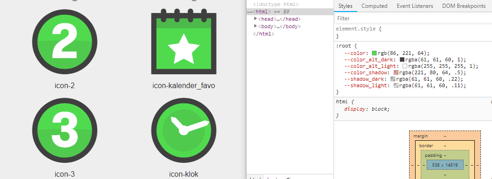

# Rebanna

Rebanna is build to easily create a webfont with support of stacked/multicolored icons.



## Getting started

### Prerequisites

1. NPM. *Rebanna* can be installed through `npm`. When you install [Node.js](https://nodejs.org/), the package manager will also be installed.
2. [Windows-Build-Tools](https://github.com/felixrieseberg/windows-build-tools) - Run as administrator `npm install --global --production windows-build-tools`.

### Installing

To install *rebanna*, run the following on the command line:

```
npm install rebanna
```

## Usage

### Configuration

Configuration can be done by command-line arguments or through a `.rebanna.js`-file. First command-line arguments will be used, followed by settings from the config file. Any non set options will be defaulted.

#### `.rebanna.js` example

```javascript
module.exports = {
  // the destination for the generated webfont
  "destination": "./font",
  // name for the font
  "fontName": "iconfont",
  // classname prefix for the icons
  "fontClassName": "icon",
  // source folder for the icons
  "iconFolder": "./icons",
  // temporary folder
  "tempFolder": "./.tmp",
  // templates for generating html, css or scss
  "template": [
    "./templates/template.html.njk"
  ],
}
```

### Running

Creating a webfont from SVG's with *rebanna* typically follows these steps:

1. Store the [correctly formated SVG's](docs/format-svg.md) in the *icons* folder.
2. Run `npm run build` on the command line to generate your webfont and template.

### CLI

Next to the npm scripts, a CLI is available. Run `rebanna [command] [options]` to generate your webfont and template.

#### Commands
| Command | Description|
| ------- |:-----------|
| `build` | Run clean, compress and split commands, Builds the webfont. Before building clean, compress and split commands will be run. |
| `clean` | Cleans the destination and temporary folder. |
| `compress` | Compresses all SVG files found in the icon source folder. |
| `split` | Split all compressed SVG files from the temporary folder. |

#### Options

| Options | Description|
| ------- |:-----------|
| `-c`, `--config` | Path to a specific configuration file. |
| `--debug` | Show extra information for debugging. |
| `-d`, `--destination` | The destination for the generated webfont. |
| `--fontName` | The name for the font. |
| `--fontClassName` | The classname prefix for the icons. |
| `-i`, `--iconFolder` | The source folder for the icons. |
| `--tempFolder` | Temporary folder for processing. |
| `--template` | An array of Nunjucks templates for generating HTML, CSS or SCSS. More information about Nunjucks templates can be found at: [https://bit.ly/2v0E7Ha](https://bit.ly/2v0E7Ha). |
| `--watch` | Add this option if you want the iconFolder to be watched. Triggers `build` on added, changed or removed file. |

## About

Ever thought about the correct name for a multi-layered-svgs-to-stacked-icons-from-a-webfont tool? I have, it's terrible, believe me. Therefore I just named it after a very special person who often makes me a stack of super fluffy banana pancakes :)

Rebanna helps you creating a multicolored iconfont. Each layer can easily be styled with CSS.

## Contribution

Feel free to push your code if you agree with publishing under the MIT license.

## Changelog

See [CHANGELOG.md](CHANGELOG.md) for changes per version.

## License

Copyright © 2018 Maarten Brakkee <maarten@zeroten.nl>. The license can be found in the [LICENSE](LICENSE) file.
